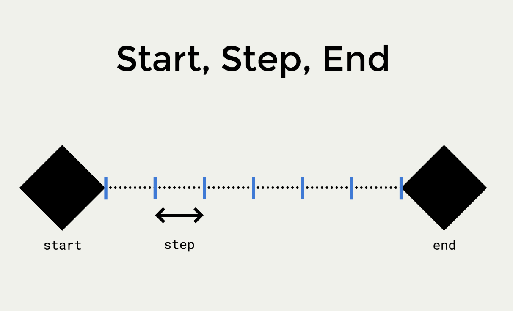

# JS05 Class 03 - Loops + Composite Data Types

## Review

#### Datatypes + Variables
* Primitive data types = strings, numbers, booleans, undefined, null, Symbol
* Every primitive datatype has properties (static) + methods (operations)
* Declaring variables = declaration - initialisation - assignment

``` var camelCase = 42; ```
#### Conditionals 

``` 
if (CONDITION 1 IS TRUE) {
    DO THIS;
} else if (CONDITION 2 IS TRUE) {
    DO THAT;
} else {
    DO SOMETHING ELSE;
}
```

#### Comparison Operators:
* "==" coerces a datatype change, so it will test equality regardless of type
* "===" tests equality including of type

```
42 == "42" // TRUE
42 === "42" // FALSE
```

* "!=" and "!==" not
* "<", ">", "<=", ">="

#### Logical Operators
* && = AND
* || = OR
* ! = NOT

## Loops

* A loop is a pieece of code that can execute over and over again.
* Loops are made up of three main parts:
    * A starting point;
    * An increment or step;
    * An ending point.




### The While Loop

* A while loop will repeat until the condition is untrue.
```
while ( condition is true ) {
    // statement(s) to repeat;
}
```

## The For Loop

* A for loop looks a bit more complicated
```
for (start; end; step) {
    // statement(s) to repeat;
}
```


``` 
for (var i = 0; i <= 10; i += 1) {
    console.log(i);
}
```

* But stick to the for loop in the beginning, because:
    * It will make sure you have all the necessary parts (start, end, step);
    * You can see all the important things right at the beginning of the statement.


## Composite Data Types
* Composite data types are types that are built from other types. They are more complex than primite datatypes.
* Think of CDT as datatypes with distinguishable parts.
* Two main composite data types:
    1. Arrays = ordered and access with an index;
    2. Objects = unordered and acess with a key.

``` 
var object = {
    key: 'value';
    name: 'Mikaela';
}
```

### Arrays

``` array = ['item', 'item 2', 'item 3'] ```

* They are lists that can be filled with any data type - both primitive and composite;
* Because they are ordered, the data can be accessed with an index.
* An _index_ is a number that is 0 based (it starts at 0).
* They can be _iterated through_.

```array[0] = 'item'```

```array[1] = 'item 2'```

* To access the final item in the array, you can use .length:

``` array[array.length-1]```

* To reassign an item in an array, you just assign it:

```array[2] = 'item changed'``` // will change item 3 to item changed

* There are several key methods available for arrays:
    * Remove the last element: ```array.pop()```
    * Add an element to the end: ```array.push()```
    * Remove the first element: ```array.shift()```
    * Add an element to the start: ```array.unshift()```
    * Find the index of an item: ```array.indexOf()```
    * Find if an item is in an array: ```array.includes('item')``` (returns true or false)
* Some other array methods include:
    * To remove existing elements in an array: ```array.splice(#index, #elementsremoved)```
    * To join elements in an array into a string: ```array.join(' ')```
    * To return part of an array: ```array.slice(#startingindex, #afterendingindex)```
    * To reverse an array: ```.array.reverse()```
    * To execute an operation on each item in an array: ```array.forEach()```
    * To accumulate elements in an array using the provided operation: ``` array.reduce(reducingFunction)```
    * To create a new array with all elements of existing array that pass the test implemented by the provided operation: ```array.filter(testingFunction)```
    * To create new array with the results of calling a provided function on every element in the existing array: ```array.map(appliedFunction)```
    
### Objects

```{Key: Value, Key2: Value2}```

* Objects are unordered.
* They are similar to dictionaries: they are a collection of key-value pairs (like a word and a definition in a dictionary).
* They can store any data type!
* Why use an object?
    * Encapsulation and modularity
    * Ways to group functionality
    * Makes sharing your code easier (e.g. as a library)
    * Give names to values
    * Work with large amounts of data effectively

* Create an object in the same way you create anything; declare it as a variable!

``` var object = {key: value, key: value} ```

* Access a value in the object using ```object.key``` or ```object["key"]```
* The latter is easier if you want to use a variable, and you don't know what the key is.

```var key = "director";```

```console.log(object[key]);```

* Replace a value by reassigning it using the accessing rules: 
```object.key = newValue ```

```user.firstName = "William"```

* Add a new key/value pair through:
```object.newKey = newValue```

```movie.language = "Hungarian"```

* You can create, access, etc. a nested object:  ```var birthDay = explorer.birth.day;```
```var explorer = {
    firstName: "Jacques",
    lastName: "Cousteau",
    birth: {
        day: 11,
        month: 6,
        year: 1910
    }
};

var birthDay = explorer.birth.day;
var birthMonth = explorer.birth.month;
var birthYear = explorer.birth.year;
```

* Do the exericses found here: https://gist.github.com/ga-wolf/10181616b156eee0ea2303ba08e3f075

* To avoid writing over a pre-existing key, nest your code in an if statement that asks whether the ```object.hasOwnProperty("key")```!
