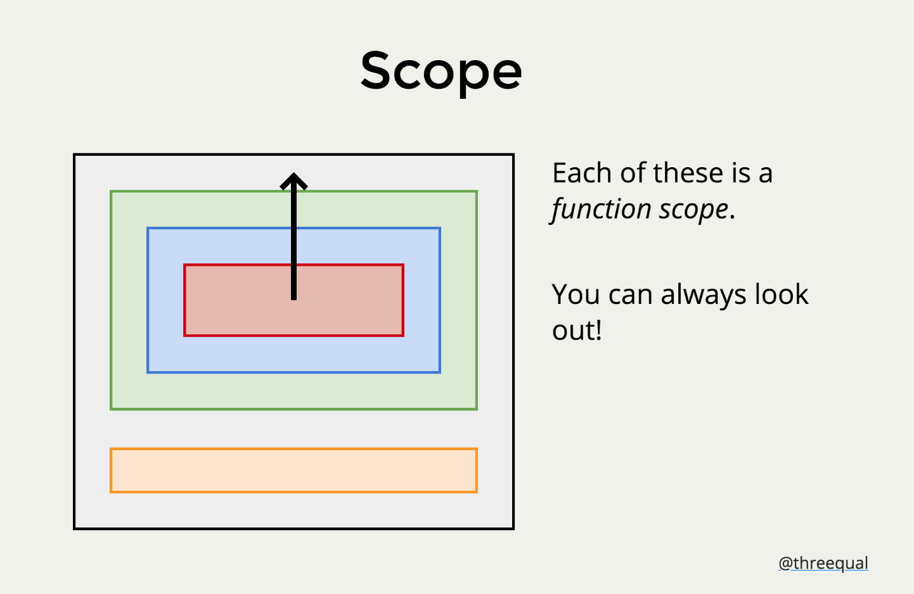

# JS05 Class 04 - Functions, Hoisting + Scope

## Review
* For loops
* Arrays
* Objects

## Functions

### What are functions?
* A reusable section of code that has a purpose and a name
* The bread and butter of JS
* They can associate names with subprograms
* Creating new words is normally bad practice, though fun. It is essential in programming!
* We give a name to a part of our program, and in doing so, we make it flexible, reusable and more readable.

### What can functions do?
* Calculations
* Animations
* Change CSS
* Change, add, or delete elements on the page
* Speak to a server (e.g. an API)
* Anything!

### How do they work?
1. Definition
2. Execution / Creating a Callsite

#### 1: Declaring Functions
* A Function Declaration

```
function sayHello () {
    console.log( "Hello" );
}
```

* A Function Expression

```
var sayHi = function () {
    console.log( "Hi" );
};
```

#### 2: Calling Functions

```
function sayHello () {
    console.log( "Hello!" );
}

sayHello(); // The callsite

```

```
var sayHello = function () {
    console.log( "Hello!" );
}

sayHello(); // The callsite
```

### Arguments / Parameters

```
function seeArguments() {
    console.log(arguments);
}

seeArguments();
seeArguments("hello");
seeArguments("hello", 2);
```

* Parameters (or arguments) allow us to provide a function with extra data or information. This is what makes a function flexible!

```
function multiply (x, y) {
    console.log( x * y );
}

multiply( 5, 4 );

multiply( 10, -2 );

multiply( 100, 0.12 );
```

### You then *pass in* data as arguments
```
var addTwoNumbers = function (x, y) {
  return x + y;
};

var firstNumber = 10;

addTwoNumbers( firstNumber, 4 );
addTwoNumbers( firstNumber, 6 );
```

* A parameter is where the data is received
* An argument is where the data is passed in (the actual data)

```
function doSomething (parameter) {}

doSomething(argument);
```

#### Function guidelines

* Make it:
    * **F**ocussed
    * **I**ndependent
    * **R**eusable
    * **S**mall
    * **T**estable
* Also, make it **E**rror-tolerant. But that isn't in the acronym


### Return

* Sometimes your function calculates something and you want the result!
* Return values allow us to do that
* We can store the result of calculations with return values. 

```
function square ( x ) {
    return x * x;
};

function double ( x ) {
    return x * 2;
}

var result = double( square( 5 ) );
```

* A return value means that a function has a result
* It is always the last line that executes

### Callbacks

* This allows us to delay: setTimeout()

``` 
function runCallback ( cb ) {
    // Wait a second
    cb();
}

function delayedFunction () {
    console.log("I was delayed");
}

runCallback( delayedFunction );
```
### Methods

* You can create a method in an object by setting the function name;

```
var person = {
    firstName: "Jacques",
    lastName: "Cousteau",
    sayHi: function () {
        console.log("Hi, I'm Jacques");
    }
};

person.sayHi();
```

### Scope
* Scope defines everything (variables, functions, values, etc.) you have access to at some point in your code
* Scope is like a pyramid. Lower scopes can access those above them, but not below.
* The top level is the Global Scope (the complete JavaScript environment).
* Essentially, scoping is name resolution. Where can you access JavaScript identifiers in your code?
* JavaScript uses Lexical Scoping: means that scope is defined by the position in source code

#### Local scope
* Function Scoping is the scope that is created when a function is called
* The scope a function creates is called Local Scope

```
var global = "Global Scope";

function someFunction() {
    var local = "Local Scope";
}

console.log(global); // => "Global Scope"
console.log(local);  // => ReferenceError
```

```
var global = "Global Scope";

function someFunction() {
    var innerScope = "Inner Scope";

    function someInnerFunction() {
        var innerInnerScope = "InnerInner Scope";
        // 3. What can we access from here?
    }

    someInnerFunction();
    // 2. What can we access from here?
}

someFunction();
// 1. What can we access from here?
```



### Hoisting
* Javascript reads through a document before it executes the code.
* It moves all the variable declarations to the top of the scope, so we know what we're talking about.
* It doesn't give var variables a value yet, it just moves them up.
* But if you create a function declaration (cf function expression), it will take the whole thing to the top, so you can call it before you delare it.
* If you move the callsite to higher up the document than the function declaration, it will call the function. But with a function expression, it won't.

* Hoisting is a way to explain the way that execution contexts work
* One way to think of it... Variable declarations and function declarations get physically moved to the top of the scope
* But really, they get put in memory during the compile phase.


