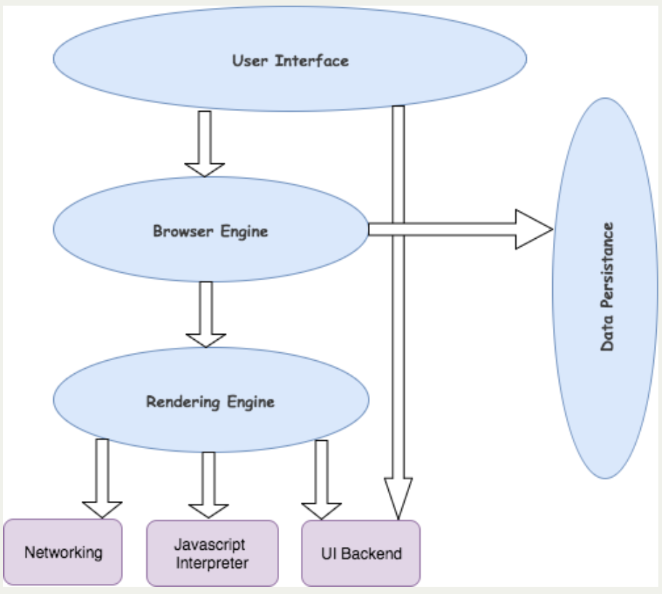
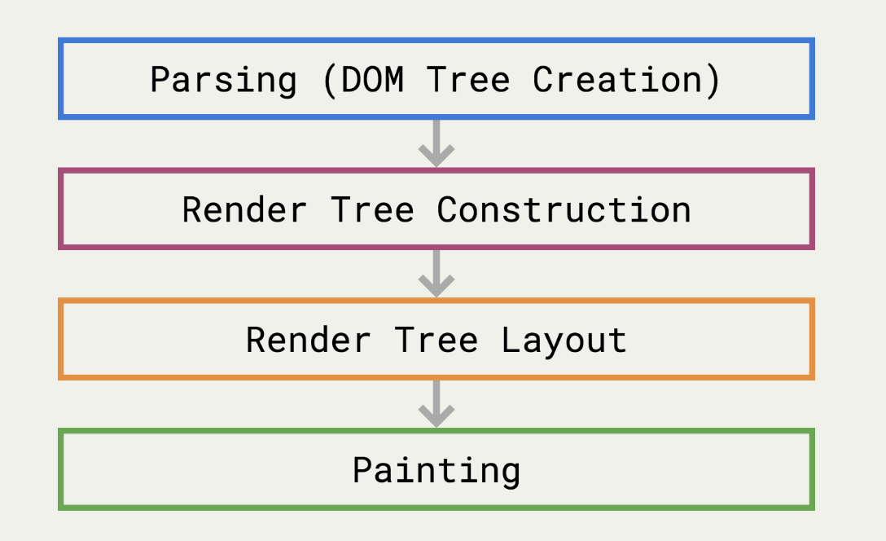
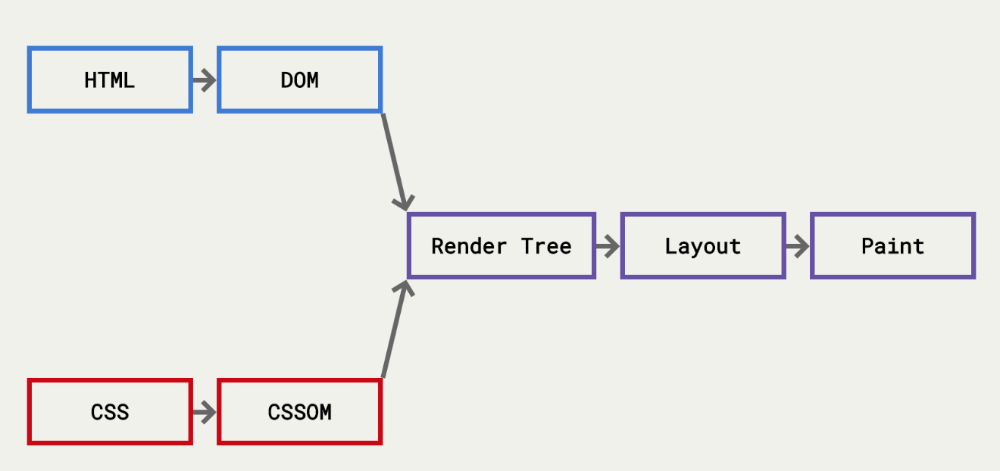
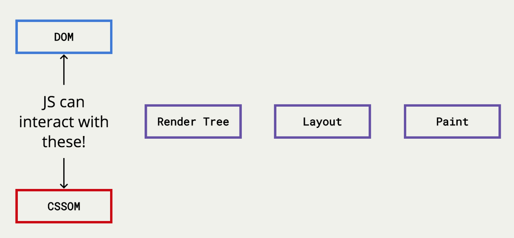
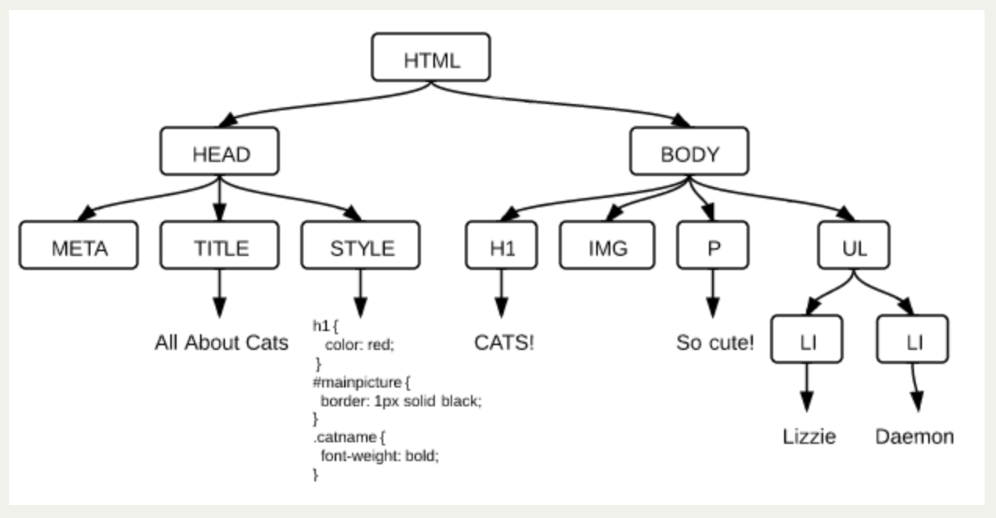

# JS05 Class 05 - JavaScript + HTML

## Adding JavaScript

How do we actually add JavaScript to an HTML document?

* Attributes:
    * the least desirable approach

    ``` <body onload="console.log('Welcome to my app!');"> ```

* Inline Scripts
    * Primarily used by back-end languages to pass data from the back-end to JavaScript.
    * That is, if the back-end wants JS to have access to the data from the database.

    ```<script> console.log("Welcome to my app"); </script> ```

* External Files: 
    * The best approach!
    * Make sure you wait until your HTML & CSS has loaded before you start manipulating them

    ```<script src="main.js"></script>```


### Browsers

* User Interface (search bar, menu etc.)
* Browser Engine (manipulates rendering engine)
* Rendering Engine (renders the page)
* Networking (retrieves URLs)
UI Backend (draws basic widgets - not just for the browser)
* JavaScript Interpreter (interprets and executes  JS)
* Data Storage (persistence layer)
* Browser parts:

* Rendering engine: 


### The DOM

* It stands for the Document Object Model
* More or less, a (potentially) large object  represented by the **document** variable
* It has properties and methods
* It's a programming interface for HTML. The way that JavaScript can affect the page

* Where does it come from?
    
    
* When the DOM changes, the page gets updated!
    * You make a change to the DOM with JS
    * The browser creates a render tree
    * The browser figures out the layout tree
    * The browser re-paints the page
* What does it look like?
    
* Key terms:
    * Each point of data is called a node
    * Each node can have parents, children and siblings
    * The DOM is accessed through a global variable called:
        * document
    * We can call methods and access properties - just like an object


### DOM Access
* The document object gives us ways of accessing the DOM, finding elements, changing styles, etc.
* The general strategy for DOM manipulation:
* Find the DOM node by using an access method and store it in a variable
* Manipulate the DOM node by changing its attributes, style, inner HTML, or by appending nodes to it.


#### Selecting element by CSS selector 

``` document.querySelector( CSS SELECTOR ); ```
* document.querySelector() = Returns the **first** DOM node that matches a given CSS selector

```
<h1>Our App</h1>

<p>Welcome</p>

<ul>
    <li>Item</li>
</ul>
```

```
var heading = document.querySelector("h1");

var para = document.querySelector("p");

var item = document.querySelector("ul li");
```


#### Selecting elements by CSS selector

``` document.querySelectorAll( CSS SELECTOR ); ```
* Returns all DOM nodes that match a given CSS selector (as an array-like thing called a NodeList)

```
<p>First para</p>
<p>Second para</p>

<ul>
    <li>Item 1</li>
    <li>Item 2</li>
</ul>
```

```
var paras = document.querySelectorAll("p");

var items = document.querySelectorAll("li");
```


#### DOM Traversal
* Selecting a function based on nodes:


```
<div>
  <h1>Hi</h1>
  <p>P tag</p>
  <h3>Heading</h3>
</div>
```

```
var pTag = document.querySelector("p");

pTag.children;

pTag.childNodes;

pTag.parentNode;

pTag.parentNode.children;

```

#### Getting attributes of an element

``` element.getAttribute();```
* Returns the current attribute value for an element.


```


<a href="https://ga.co" id="generalAssembly">
    A link to GA
</a>
```

```
var image = document.querySelector("img");

var srcText = image.getAttribute("src");
var altText = image.getAttribute("alt");

var aTag = document.querySelector("a");

var href = aTag.getAttribute("href");
var id = aTag.getAttribute("id");
```

#### Setting attributes of an element

```element.setAttribute()```
* Changes an existing attribute value or adds a new attribute for an element and assigns a value.

```


<a href="https://ga.co" id="generalAssembly">
    A link to GA
</a>
```
```
var image = document.querySelector("img");

var srcText = image.setAttribute("src", "http://placecage.com/200/200");
var altText = image.setAttribute("alt", "Another image");

var aTag = document.querySelector("a");

var href = aTag.setAttribute("href", "/home");
var id = aTag.setAttribute("id", "home");
```

#### Creating DOM Nodes or changing text

* We can make our own HTML elements as well!

```element.innerText```
```element.innerHTML``` <- includes any HTML tags

```
// Create Element in Memory
var newPara = document.createElement( "p" );

// Set the text
newPara.innerText = "Created with JS";

// Set the styles
newPara.style.fontSize = "24px";
newPara.style.color = "hotpink";

// Put it on the page
document.body.appendChild( newPara ); // Or...
document.body.insertBefore(newPara, document.body.firstChild); // Or...
document.body.innerHTML += newPara;
```


#### Getting values

```element.value```
```
<input type="text" value="User types here">
```
```
var input = document.querySelector("input");

var currentValue = input.value;

input.value = "Something else";

var newValue = input.value;
```

#### Getting + setting styles

* You have to getComputedStyle first before you can access smaller parts of it.
* CSS properties that normally have a hyphen in it, you must camelCase it
* Number properties must have a unit - they won't default to pixels

```
<h1>Hello World</h1>
```

```
var heading = document.querySelector("h1");

// Getting Styles
var currentStyles = getComputedStyle(heading);
var fontSize = currentStyles.fontSize;

// Setting Styles
heading.style.width = "400px";
heading.style.fontSize = "24px";
```


