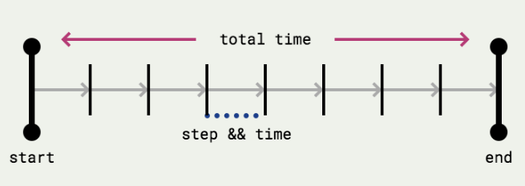

# JS05 Class 06 - Advanced JavaScript + HTML

## Review
* Adding javascript to the page - inline attributes (not good); script tags with inline JS (less bad); script tag with srcd js file (best).
* How a browser renders a page - file gets parsed (by the browser); file gets turned into DOM (interface between HTML and JS) and CSS gets chucked in; then DOM gets painted - when the pixels get put on the page. Then DOM and paint keeps cycling through!
* DOM traversal is how we interact with the DOM - we select an element through DOM traversal.
    * "document." prefixes how we interact with it
    * ```document.querySelector("validCSSSelector")` will traverse the DOM and find first node that meets the CSS selector.
    * ```document.querySelectorAll("validCSSSelector")` will traverse the DOM and find all nodes that meet the CSS selector and return as an array ("DOM Node list").
* You can access information in the DOM:
    * ```var pTag = ...` once you've specified a node of the DOM.
    * ```pTag.innerText` will return the text.
    * ```pTag.innerHTML` will return text as HTML.
    * ```pTag.getAttribute("ATTRIBUTE")` returns the value of the attribute mentioned.
* You can set information in the DOM:
    * ```pTag.innerText = "NEW TEXT"` will ignore any HTML contained.
    * ```pTag.innerHTML = "NEW HTML"` adds text as HTML.
    * ```pTag.setAttribute("ATTRIBUTE","VALUE")` allows you to set the attribute with the value you want.
    * Anything you can add with HTML, you can add in JS.
* You can create nodes in the DOM:
    * ```document.createElement("ELEMENT")` creates a new Node that you can add to the page.
    * ```document.body.appendChild( newPara ); // Or...```
    * ```document.body.insertBefore(newPara, document.body.firstChild); // Or...``
    * ```document.body.innerHTML += newPara;```


## JavaScript DOM manipulation patterns

### Select, Manipulate, Admire
* Step 1: Select element and store a reference
```var p = document.querySelector("p");`
* Step 2: Manipulate the element (optional)
```p.innerText = "Something new";`
```p.style.color = "hotpink";`
* ​Step 3: Admire

### Create, Manipulate, Inject
* Step 1: Create element as a reference
```var p = document.createElement("p");`
* Step 2: Use a method to manipulate (optional)
```p.innerText = "Something new";`
```p.style.color = "hotpink";`
* ​Step 3: Add it to the page
```document.body.appendChild(p);`


## Events

### Creating event handlers

### Callbacks
* What are callbacks? Just a fancy name for JavaScript functions
* Only difference is that you don't decide when these functions run
* They are functions that act as a response: when X happens, call this callback.
* They are a part of *Higher-Order Functions*
    * ​Functions that receive functions as input, or return functions as output

* What are events?
    * Every browser has events built-in
    * Events are important moments that take place on a webpage
    * We can attach functions (or callbacks) to these moments, and the browser will call them for us
    * There are lots of events

#### Some Terminology
*Event:* something that happens
*Callback:* a function that executes after the event has happened
*Event listener:* a method that binds an event to a callback

#### Three important things:
* The element that is going to be interacted with (body, h1, p etc.)
* The event type (click, hover, scroll etc.)
* The response (often called the callback - a function!)

#### Events Pseudocode
```
WHEN the element with ID of toggle is CLICKED
    SELECT the body tag and save as body
    CHANGE the body CSS to have a hotpink background
```
```
WHEN the element with ID of toggle is CLICKED
    SELECT the body tag and save as body
    STORE the currentBackground of body
    IF currentBackground === "hotpink"
        CHANGE the body CSS to have a ghostwhite background
    ELSE
        CHANGE the body CSS to have a hotpink background
```
```
WHEN the page is scrolled
    CREATE an image of bill, save it as bill
    CHANGE the src of bill to be http://fillmurray.com/500/500
    APPEND it to the page
```

#### el.addEventListener

``` var myButton = document.querySelector("button");`

```
myButton.addEventListener("click", function() {
  console.log("button clicked!");
});
```

### The basic process:
1. Find the element
2. Add the event listener and pass in a function to call

#### Anonymous Functions

* This is a very simple way of creating an event listener with a set function.
* You can't ever remove that event handler!

```
var myButton = document.querySelector("button");

myButton.addEventListener("click", function() {
  console.log("button clicked!");
});
```


#### Referenced Events
```
var myButton = document.querySelector("button");

function myCallback() {
  console.log("button clicked!");
}

myButton.addEventListener("click", myCallback);

myButton.removeEventListener("click", myCallback);
```

* The more variables you have, the easier it will be to debug - I would start off defining everything
* Once you get more comfortable, you can start storing less
* But I much prefer using named functions rather than anonymous functions (for debugging purposes, and because you can remove the event listener).

#### What events are there?
* We always create them in the same way, but these are some of the available events:
    * Mouse events = https://api.jquery.com/category/events/mouse-events/
    * Keyboard events = http://api.jquery.com/category/events/keyboard-events/;
    * Form events = https://api.jquery.com/category/events/form-events/
    * Browser events = https://api.jquery.com/category/events/browser-events/

* They always look the same!
```
TARGET.addEventListener(
    EVENT_TYPE, 
    CALLBACK_FUNCTION
);
```

### Using the event parameter

* When JavaScript runs an event handler, it automatically provides us with a little bit of information as a parameter
    * How long we have been on the page
    * Where the mouse was
    * What key was pressed
    * The target of the event
    * etc.
* We can call it whatever we would like, but the names e and event are very common.

```
var button = document.querySelector("button");
var eventType = "click";
function onButtonClick(event) {
    console.log(event);
}

button.addEventListener(eventType, onButtonClick);

window.addEventListener("mousemove", function (event) {
    console.log(event);
});
```


## Timers: What are timers?
* There are two main ways to work with time in JavaScript
    * You can set a delay with setTimeout
    * You can set an interval with setInterval

``` window.setTimeout( CALLBACK, TIME_IN_MS );`

``` function delayedFunction() {}

window.setTimeout( delayedFunction, 1000 );
```


``` window.setInterval( CALLBACK, TIME_IN_MS );`
```
function regularlyScheduledProgram() {}

window.setInterval(regularlyScheduledProgram, 1000);
```


## Animations



* Things you need to define:
    * Starting Point
    * Step
    * Time between steps
    * Total time
    * Ending Point

```
SELECT and STORE the image as bill

CREATE a function called fadeBillAway
  GET the current opacity and store as currentOpacityAsString
  GET the current opacity as a number and store as currentOpacity
  CREATE newOpacity by subtracting 0.01 from currentOpacity
  UPDATE bill opacity to be newOpacity
  IF the currentOpacity is >= 0
    CALL fadeBillAway in 10ms

CALL fadeBillAway to start the animation
```
```
var bill = document.querySelector("img");

function fadeBillAway() {
  var currentOpacityAsString = getComputedStyle(bill).opacity;
  var currentOpacity = parseFloat(currentOpacityAsString, 10);
  var newOpacity = currentOpacity -= 0.01;
  bill.style.opacity = newOpacity;
  if (currentOpacity >= 0) {
    window.setTimeout(fadeBillAway, 10);
  }
}

window.setTimeout(fadeBillAway, 1000);
```
### Homework

<!-- Finish all exercises from class
Catwalk: https://gist.github.com/ga-wolf/083d0b3e1ef559c12128375664b93570
Dancing cats:
https://gist.github.com/ga-wolf/ae7d0e1df214e45213c5 -->


Make previous exercises dynamic!
Plus, anything else!
Create your own Endless Horse: http://endless.horse/
Train Stations: https://gist.github.com/ga-wolf/cbf4b4ddc1bcebc16afb7aae3ad785f1#a-transit-application
99 Bottles: https://gist.github.com/ga-wolf/b481809fbc843accf84940796a36d629#99-bottles-of-beer
Working with Users:
https://gist.github.com/ga-wolf/cbf4b4ddc1bcebc16afb7aae3ad785f1#working-with-users
Bonus: Make Users work with Local storage