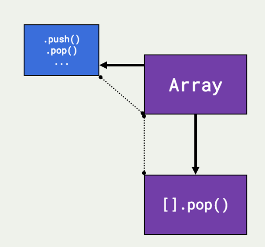
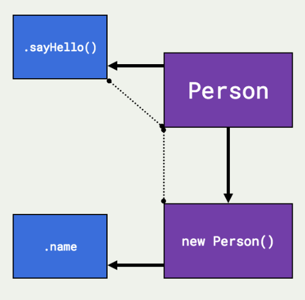

# JS05 Class 08 - This, Factories & Constructors

## Review
* Templating: ` = ES6/ES2015
    * Interpolation - ${variable}
    * Multiline strings
* Functional array methods
    * ```[].forEach(cbFunction(item,index,collection){});```
    * ```[].filter(predicateFunction(item,index,collection){})```
    * ```[].map(cbFunction(item,index,collection){})```
    * ```[].reduce(cbFunction(){})```
* Lab


## ```this```

* One of the most confusing mechanisms in JavaScript.
* A special identifier that's automatically defined for us (an always available variable).
* Kind of, sort of, almost, only readable. You can't change its value in the same way as you normally would.
* It all comes back to the call-site.
* To understand how the this keyword works, we need to know exactly where and how the function was called (and by who).
* There are more ways than we have seen so far!
* *Every* function, when it is running, has access to its current execution context.
* Why does *this* exist? So we can:
    * Reuse functions with different contexts
    * Change the focus of our code
    * Make methods more dynamic
* We don't always know what we are talking about!

### The call-site
* Knowing that this represents the context of whatever code is running, there are five main ways of it being automatically defined for us:
1. Global Binding (window)
2. Event Binding
3. Implicit Binding
4. Explicit Binding
5. new Binding

#### 1. Global Binding
```
console.log( this );

function checkThisOut() {
    console.log( this );
}

checkThisOut();
```
* This is the default binding!
* It refers to the window object.

#### 2. Event binding
```
var img = document.querySelector("img");

function onImageClick() {
    console.log( this );
}

img.addEventListener("click", onImageClick);
```
* When you run an event listener, the this keyword refers to whatever was interacted with
* In the above case, it is the image DOM node!

#### 3. Implicit binding
```
var person = {
    name: "Groucho",
    speak: function () {
        console.log( this, this.name );
    }
};

person.speak();
```
* When you run a method, the this keyword will refer to the containing object
* In this case, the person object!

#### 4. Explicit binding
```
function sayHello() {
    console.log( "Hello, " + this.name );
}

var person = { name: "Zeppo" };

sayHello.call( person );
sayHello.apply( person );


```
* When you use .call, the this keyword refers to the parameter you provide. In this case, the person object!
* When you use .apply, the this keyword refers to the parameter you provide. In this case, the person object!
```
function sayHello() {
    console.log( "Hello, " + this.name );
}

var person = { name: "Zeppo" };

var personsHello = sayHello.bind( person );
personsHello();
```
* When you use .bind, the this keyword refers to the parameter you provide. In this case, the person object!

#### 5. new Binding

```var Person = function (name) {
    this.name = name;
    console.log( this );
    // => { name: "Roger" }
};

var serge = new Person( "Serge" );
```
* When you use the new keyword:
    * JS creates a new object!
    * It implicitly returns - it returns the object that is created
* New uses UpperCamelCase rather than regular camelCase.

* When you use new, the this keyword refers to a new empty object that you can add properties to.
* It is also implicitly returned (automatically returned).

* You can use *new* to create objects that are used over and over again - your own data types / blueprints.

### Determining this
* The order of precedence:
    1. Is the function called with the new keyword? It's a new, empty object.
    2. Is the function called with .call, .apply or .bind? It's what ever is passed into the function.call(), .apply() or .bind()
    3. Is the function called on an object (is it a method)? It's the containing object.
    4. Is the fuction added as an event listener? It's whatever the target of the event was.
    5. Otherwise, it is the default binding - the global object

#### Extra resources
* Tyler McGinniss: WTF is this? !(https://tylermcginnis.com/this-keyword-call-apply-bind-javascript/)
* Todd Motto: this !(https://toddmotto.com/understanding-the-this-keyword-in-javascript/)
* MDN: this !(https://developer.mozilla.org/en-US/docs/Web/JavaScript/Reference/Operators/this)
* Kyle Simpson: this and Object Prototypes !(https://github.com/getify/You-Dont-Know-JS/tree/master/this%20%26%20object%20prototypes)
* JavaScript is Sexy: this !(http://javascriptissexy.com/understand-javascripts-this-with-clarity-and-master-it/)
* Rachel Ralston: this !(https://dev.to/rachelralston/the-this-keyword-in-javascript)
* Quirks Mode: this !(https://www.quirksmode.org/js/this.html)


## Prototypes & Inheritance

* ​When you create a piece of data, that data will be linked to a parent thing. Really, it becomes an instance and is linked to a prototype
* The Prototype Chain is the link
* We can delegate behaviour through this
* Essentially, the prototype is a blueprint and then we use it to create something
    * We can create a constructor
    * We can add generic properties and methods to the prototype
    * We can create instances
    * We can add specific properties and methods to the instance
    * We can also extend this prototype chain to other constructors




## Factories & Constructors
* What are they? Both:
    * Are JavaScript patterns
    * Help us easily create objects
    * Help us share functionality
    * That makes our code really reusable
    * Give us consistency in our data
    * Can give us inheritance
    * Can help us have private data

### Factories

#### Factory pattern
```
var DogFactory = function (name, breed) {
    var dog = {};
    dog.name = name;
    dog.breed = breed;
    return dog;
};

var tamaskan = DogFactory("Tammy", "Tamaskan");
var buddy = DogFactory("Buddy", "Labrador");
```

#### Factory + inheritance
```
var AnimalFactory = function () {
    var animal = {};
    animal.isAlive = true;
    return animal;
};

var DogFactory = function (name, breed) {
    var dog = AnimalFactory();
    dog.name = name;
    dog.breed = breed;
    return dog;
};

var tamaskan = DogFactory("Tammy", "Tamaskan");
```

### Constructors

#### Constructor pattern
```
function Person() {}

var serge = new Person();

serge instanceof Person; // => true
```
```
function Person(name) {
  this.name = name;
}

var serge = new Person("Serge");
```
```
function Person(name) {
  this.name = name;
}

Person.prototype.sayHello = function() {
  console.log(`Hello, I am ${this.name}`);
};

var serge = new Person("Serge");
serge.sayHello();
```
```
var Dog = function ( name, breed ) {
    this.name = name;
    this.breed = breed;
    this.bark = function () {
        console.log( "Woof!" );
    }
};

var tamaskan = new Dog( "Tammy", "Tamaskan" );
var buddy = new Dog( "Buddy", "Labrador" );
```

#### Constructors + privacy
```
function User(username, email, password) {
  this.username = username;
  this.email = email;
  this.authenticate = function(providedPassword) {
    return password === providedPassword;
  };
}

var serge = new User("serge", "serge@ga.co", "chicken");
```

```
function Car(brand) {
    this.brand = brand;
}

function ElectricCar(brand) {
    Car.call(this, brand);
    this.electric = true;
}

ElectricCar.prototype = Object.create(Car.prototype);

var tesla = new ElectricCar("Tesla");
```

#### Constructors + inheritance
```
function Animal(breed) {
  this.breed = breed;
};
Animal.prototype.beBorn = function() {
  this.alive = true;
  console.log(`A ${this.breed} is born!`);
};

function Dog(name, breed) {
  Animal.call(this, breed);
  this.name = name;
};
Dog.prototype = Object.create(Animal.prototype);
Dog.prototype.bark = function() {
  console.log(`Woof, woof! Says ${this.name}`);
};

var tammy = new Dog("Tammy", "Tamaskan");
```

Extra resource: https://github.com/getify/You-Dont-Know-JS/tree/master/this%20%26%20object%20prototypes
