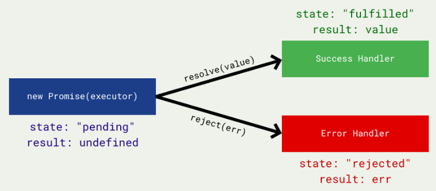

# JS05 Class 09 - Higher Order Functions + Async Programming

## Review
* ```this` --> context
    1. Global binding: ```this === window`
    2. Event binding: ```this === event target`
    3. Implicit binding: ``` this === object containing method`
    4. Explicit binding: ```this === parameters passed into .call(), .apply() or .bind()`
    5. _new_ binding: ```this === new empty object {}`
* Prototypes
* Factories
* Constructors

## Higher Order Functions
* What are they? A higher-order function (H.O.F) is a function that operates on other functions: either by receiving it as a parameter, or by returning a function
* Why would you use them?
    * Creating utility functions
    * Leads to D.R.Y code (Don't Repeat Yourself)
    * Creates more declarative programming
        * ​You describe patterns
        * The opposite is imperative programming, where you describe every single step
    * Leads to more maintainable, readable and composable code
    * Very common for libraries (like Lodash)

### Functions as Input
```
function regularlyCalled() {
    console.log("Named function");
}

setInterval(regularlyCalled, 1000);

setTimeout(function () {
    console.log("Anonymous Function");
}, 1000);
```

```
function repeatLog(num) {
    for (var i = 0; i < num; i += 1) {
        console.log(i);
    }
}

repeatLog(10);

repeatLog(4);
```
```
function forEach(arr, callback) {
    for (var i = 0; i < arr.length; i += 1) {
        callback( arr[i], i );
    }
}

function handler(item, index) {
    console.log(item, index);
}

forEach(["one", "two", "three"], handler);

forEach(["one", "two", "three"], function (item, index) {
    console.log(item, index);
});
```

### Functions as Output

```
function creator() {
    return function () {
        console.log("Returned function");
    }
}

var created = creator();
created();
```
```
function createGreeting(start) {
    return function(name) {
        console.log(start + ", " + name);
    }
}

var hi = createGreeting("Hi");
hi("Jane");

var hello = createGreeting("Hello");
hello("Jeff");
```
```
function makeAdder(x) {
    return function (y) {
        return x + y;
    }
}

var addTen = makeAdder(10);

console.log( addTen(25) );
console.log( addTen(116) );
```

#### Practice
* Make a repeat function that runs any arbitrary function
* Create an unless statement
* Create your own filter function for arrays
* Create your own reduce function for arrays
* Create your own map function for arrays
* Create anything else you see here

## Promises
* What are promises?
    * Promises represent eventual results of an asynchronous operation
    * "A Promise is an object representing the eventual completion or failure of an asynchronous operation"
    * It's an object that may produce a single piece of data at some point in the future
        * Either a resolved value
        * Or a rejection (an error that tells us why it wasn't resolved)

### States & Fates
* https://github.com/domenic/promises-unwrapping/blob/master/docs/states-and-fates.md
* Promises have three mutually exclusive potential states:
    * **Fulfilled**: The action relating to the promise succeeded 
    * **Rejected**: The action relating to the promise failed
    * **Pending**: Hasn't fulfilled or rejected yet
* We say that a promise is "settled" if it isn't pending.
* Promises have two mutually exclusive potential fates:
    * **Resolved**: Finished (or locked into a thenable or another promise)
    * **Unresolved**: If trying to resolve or reject will make an impact

* A little like event listeners... But...
* A promise can only succeed or fail once
* If a promise has succeeded or failed and you later add a success/failure callback, the correct callback will be called (even though the event happened earlier)

* Why use promises?
    * They help us write readable code
    * They help us deal with the complexities of asynchronous programming
    * They help us avoid "callback hell" || "the pyramid of doom"
    * They are the backbone of some of the newer features coming out with JavaScript (e.g. async and await)
    * Lots of libraries/frameworks/packages use promises (so we will have to be the consumers of them anyway)

* Some Terminology
    * **Executor:** A function that contains the producing code
    * **Fulfilled:** Succeeded
    * **Rejected:** Failed
    * **Pending:** Waiting
    * **Settled:** Not pending
    * **Resolved:** Finished
    * **Unresolved:** If trying to resolve or reject will make an impact
    * **Thenable:** A piece of data that is promise-like (it has a .then method)

* How do they work?


```
var promise = new Promise(function (resolve, reject) {
    if ( true ) {
        resolve("Will go to the .then");
    } else {
        reject("Will go to the .catch");
    }
});
```

* The executor callback function automatically receives a resolve function and a reject function

### [Creating promises and HOFs](http://jsbin.com/qoqeqevixi/edit?js,console)
```
function createPromise() {
    return new Promise(function (resolve, reject) {
        if ( true ) {
            resolve("Will go to the .then");
        } else {
            reject("Will go to the .catch");
        }
    });
}
```

### [Consuming promises](http://jsbin.com/bidobaduma/edit?js,console)
```
var promise = new Promise(function (resolve, reject) {
    if ( true ) {
        resolve("Will go to the .then");
    } else {
        reject("Will go to the .catch");
    }
});

promise
    .then(function(data) { console.log(data); });
```

* The data you provide to the resolve function will be passed to the .then callback function

### [Consuming promises + hof](http://jsbin.com/bavopikuve/edit?js,console)
```    
function createPromise() {
    return new Promise(function (resolve, reject) {
        if ( true ) {
            resolve("Will go to the .then");
        } else {
            reject("Will go to the .catch");
        }
    });
}

createPromise()
    .then(function (data) { console.log(data); });)
```

### [Chaining promises](http://jsbin.com/wujuguyoyu/edit?js,console)
```
function getNumbers() {
  return new Promise(function (resolve, reject) {
    resolve([1, 2, 3, 4, 5, 6, 7, 8, 9, 10]);
  });
}

function filterToEvenNumbers(nums) { /* ... */ }

function multiplyByFive(nums) { /* ... */ }

getNumbers().then(filterToEvenNumbers).then(multiplyByFive);
```
### [Handling promises](http://jsbin.com/nipasudebi/edit?css,js,output)
```
var promise = new Promise(function (resolve, reject) {
  if ( false ) {
    resolve("Will go to the .then");
  } else {
    reject("Will go to the .catch");
  }  
});
function successHandler() { /* ... */ }
function errorHandler() { /* ... */ }

promise.then(successHandler).catch(errorHandler);
```
* The data you provide to the reject function will be passed to the .catch callback function

### Exercise: 
Turn an event into a promise!
I want to be able to write something along these lines:
onClick("h1").then(/* ... */);
onClick("p").then(/* ... */);

