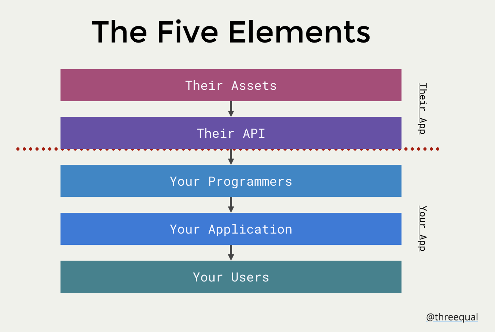
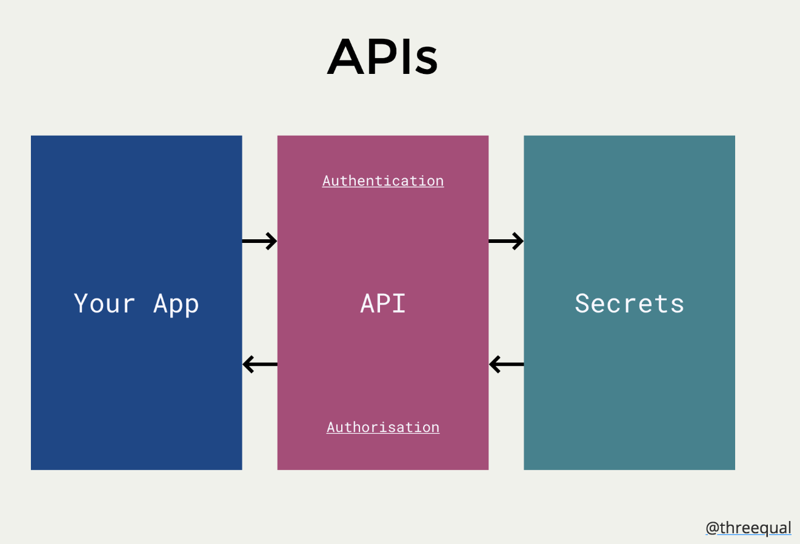
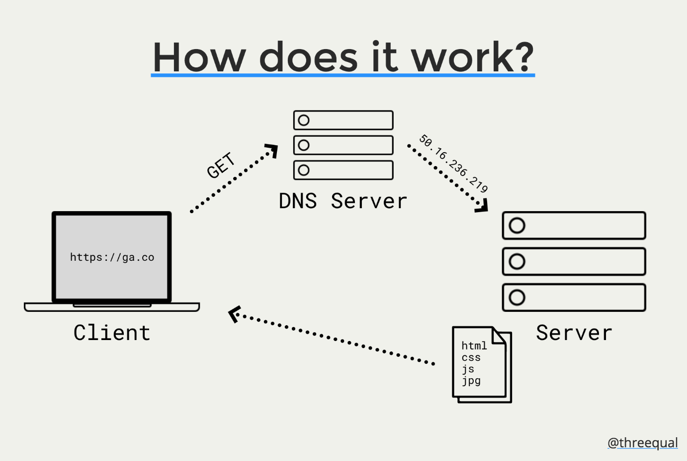

# JS05 Class 10 - AJAX and APIs

## Review
* Promises

## APIs
* Application Programming Interfact = API
    * Applcation = any application
    * Programming - The engineering part that translates given inputs into outputs
    * Interface - The interface, the way we interact
* Software that allows two programs to communicate with each other
* It all starts with shared data
* The principle of API abstraction allows for decoupling applications
* Can be private or public

### What is an API?
Any interface that software can use to access some piece of currency (e.g. data, processes etc.)
They are a standard way of communicating between systems, that hides the complexities

* Types of APIs
    * Operating systems
    * Remote APIs
    * Libraries, frameworks and software development kits
    * Web APIs

### How do APIs work?



* Assets - Anything that is chosen to be shared (data, processes etc.)
* API - The gateway to those assets
* Developers - The API is exposed to your developers
* Your Application - Your developers code your application, and it is powered by the API
* Your Users - Your users use the app that is created

### Authentication + authorisation



* Authentication = Are you allowed to access the system?
* Authorisation = What can you access in the system?
* Often we need to sign up to APIs

### How do APIs work?
```
function addFortyTwo (x) {
    var result = x + 42;
    return result;
}
```
```
function doSomething (yourData) {
    // Secret stuff!
    return secretStuff;
}
```
 
### Web APIs
* To use these:
    * We use the web!
    * We make an HTTP request (and we provide all necessary information - often in JSON format)
    * The API performs all of their fancy stuff
    * The API returns the data as an HTTP response
    * We use the data
 
#### But how does the web work?



### HTTP Methods
* GET - Asking for data
* PUT - Updating data
* POST - Creating data
* DELETE - Deleting data
* Plus more!

### Libraries, Frameworks & SDKs
* To use these:
    * You either download & include the code
    * Or it is provided by the platform
        * ​e.g. browsers provide functionality for all sorts of things (video, audio, 3D stuff etc.)

### A Web Platform Sojourn
* What are some of the latest APIs that the web platform is providing?
    * Payment Request API
    * Generic Sensor API
    * WebGL
    * WebVR
    * Speech Recognition and Speech Synthesis
    * Progressive Web Apps
    * Notifications API
    * Plus, many more...


## Benefits of APIs

### Benefits for providers
* APIs let you build one app off another
* APIs are like a universal plug
* APIs can be profitable
* APIs can allow you to decouple code - can make your applications more performant and finding developers easier
* APIs can essentially outsource complexity
* API providers can promote your application

### Benefits for consumers
* APIs can allow you to get data, and add features, that would otherwise be difficult and time-consuming
* APIs can make your app realtime
* APIs can introduce similar flows to an application (e.g. logins etc.)
* Apps using APIs can provide useful starting data for users

### Downsides
* Building them
* Maintenance
* Hosting
* Documentation
* For developers - future support
* Reliance on other services

### Some Applications
* Uber
* Instagram
* Buffer
* Google Assistant / Siri / Alexa
* Xero
* Meetup
* General Assembly
* Panda
* Plus your app!

### API resources
* Todd Motto: Public APIs = https://github.com/toddmotto/public-apis
* Any API = https://any-api.com/ 
* APIGee = https://apigee.com/console/twitter?apig_cc=1
* Postman = https://www.getpostman.com/

## AJAX

### What is AJAX?
* Asynchronous JavaScript & eXtensible Markup Language
* It is a way to make your pages live
* You can talk to other servers while you are still on the page
* It is a technique to send and retrieve information behind the scenes without needing to refresh the page

### Where is AJAX used?
* In feeds (such as twitter)
* Chat rooms and messaging apps
* For voting and rating
* Autocompletion
* Form submission and validation
* To access data that you don't have
* To show extra information
* In games (e.g. to save scores)

### Why is AJAX so good?
* It makes your pages live
* It is much faster
* It tends to give a greater user experience
* It is fancy
* It is popular in the workplace
* It is the foundation of things such as APIs

### How do we work with it?
* XMLHttpRequest
* Fetch

### One thing!
* To make API requests, we typically need a server (AJAX doesn't  work on a file URL)
* Install HTTP-Server: https://www.npmjs.com/package/http-server
* Restart the terminal
* To start the server: run the following command in the directory you want to serve and open the URL it provides
```http-server .`

## Fetch

### What is Fetch?
* It is a way to make AJAX Requests
* It is a function that is defined automatically for us
* It is supported by all major browsers now
* For those that don't support it, there is a polyfill
* You make an HTTP Request with it
    * Specifying the URL, the method etc.
* It comes back with an HTTP Response
    * ​Most of the time, the data is returned as JSON
* Then returns a Promise
    * We can work with the returned data in a .then

```
fetch( URL, HTTP_OPTIONS? )
    .then( SUCCESS_HANDLER )
    .catch( ERROR_HANDLER );
```
```
fetch("http://api.open-notify.org/astros.json")
    .then(function (res) {
        return res.json();
    })
    .then(function (data) {
        console.log(data);
    });
```

1. We have make a Request to the API
2. We parse the Response and turn it into a JS Object with .json()
3. We can then work with the data!

### Parameters
* We can attach a Query String or Parameters to a URL
* This provides extra information to the API
* Works in a similar way to an object - query strings have keys and values
* Looks something like this:
```?keyOne=valueOne&keyTwo=valueTwo&keyThree=valueThree`

```
fetch("https://randomuser.me/api/?results=10")
    .then(function (res) {
        return res.json();
    })
    .then(function (data) {
        console.log(data);
    });
```
1. We have make a Request to the API
2. We parse the Response and turn it into a JS Object with .json()
3. We can then work with the data!

```
fetch("https://randomuser.me/api/?results=10&gender=male")
    .then(function (res) {
        return res.json();
    })
    .then(function (data) {
        console.log(data);
    });
```
1. We have make a Request to the API
2. We parse the Response and turn it into a JS Object with .json()
3. We can then work with the data!

### OMDB APi
* Go to OMDB APi's Website
* Get an API Key from here and select Free
* Input your details
* Check your email
* Click the verify API key link
* Copy your API key from that email

```
fetch("http://www.omdbapi.com/?t=Jaws&apikey=API_KEY_GOES_HERE&plot=full")
    .then(function (res) { 
        return res.json() 
    })
    .then(function (data) { 
        console.log(data) 
    });
```

### OpenWeatherMap API
* Go to the OpenWeatherMap APi website
* Sign up for an API key here
* Fill in your details
* Log in
* Go to the API Key Tab on your settings page
* Copy the API Key
* It'll take ten minutes for the API Key to work

```
var baseURL = "http://api.openweathermap.org/data/2.5/weather";
var parameters = "?q=Sydney&units=metric&appid=API_KEY";

fetch(baseURL + parameters)
    .then(function (response) {
        return response.json();
    })
    .then(function (data) {
        console.log(data);
    });
```

## Resources
* MDN: Using Fetch: https://developer.mozilla.org/en-US/docs/Web/API/Fetch_API/Using_Fetch
* CSS Tricks: Using Fetch: https://css-tricks.com/using-fetch/
* Scotch.io: Fetch: https://scotch.io/tutorials/how-to-use-the-javascript-fetch-api-to-get-data
* David Walsh: Fetch: https://davidwalsh.name/fetch
* Google Developers: Fetch: https://developers.google.com/web/updates/2015/03/introduction-to-fetch
* Google Developers: Working with the Fetch API: https://developers.google.com/web/ilt/pwa/working-with-the-fetch-api
* MDN: Fetch API: https://developer.mozilla.org/en-US/docs/Web/API/Fetch_API