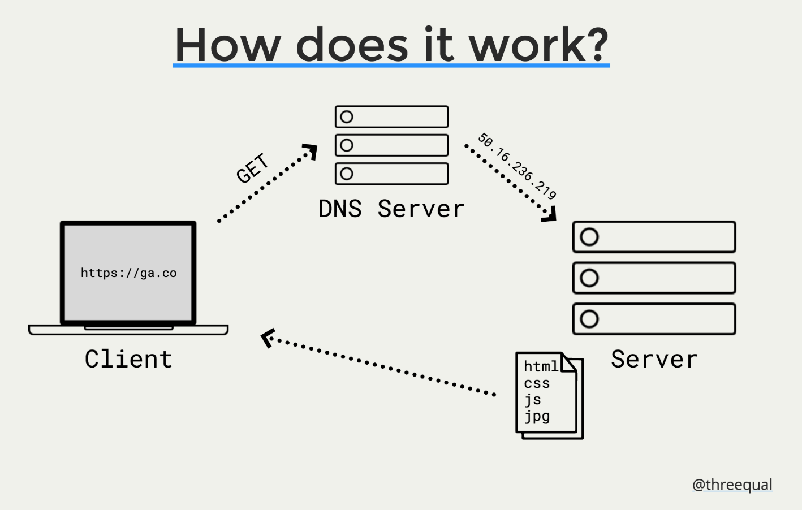

# JS05 Class 00 - Instalfest

## What are we installing?
* Slack
* Browser - Google Chrome
* Text Editor - VS Code: https://code.visualstudio.com/ 
* Ubuntu on Windows or VirtualBox
* Terminal - iTerm2: https://www.iterm2.com/
* GitHub: https://github.com/
* Git: https://git-scm.com/
* Node: https://nodejs.org/en/
* Twitter

### Setting up command line tools:

```xcode-select --install```

* Install brew: https://brew.sh/ 
* Install Git

```brew install git```

* Restart the terminal

```git --version```

* Configure git

```git config --global user.email "YOUR GITHUB EMAIL"```

```git config --global user.name "YOUR GITHUB NAME"```

### Installing node
* Install NVM: https://github.com/creationix/nvm
* On Ubuntu, you'll need to run sudo apt install curl first
* Run the curl script that is on that page
* Restart the terminal

```nvm install node```

```nvm alias default node```

* Restart the Terminal

```node --version```

## Web Fundamentals

* What is the web?
    * Billions of connected devices through a series  of networks
* Are the internet and the web the same?
    * Nope! The Web is a physical network of devices
    * The Internet is the virtual network of information
* Where did it come from?
    * J.C.R. Licklider came up with 'The Galactic Network' (Aug. 1962)
    * ARPAnet in the 1960's for the US Government
Vint Cerf and Bob Kahn invented TCP/IP in 1974
    * Then, Tim Berners-Lee released the "World Wide Web" in 1991, with this site.



### Programming vs Coding

* Coding is the practice of writing in a language that a computer interprets to perform a task. It requires knowledge of a specific language.
* Programming is the ability to solve problems, or rather, instruct a device to be able to solve problems. ​This is shared between languages.

### Pseudocode

* Pseudocode is the language we use when writing a program without using the syntax of a programming language
* It's a universal programming language for humans
* It is a way to plan - essentially a shorthand we use before we write a program

